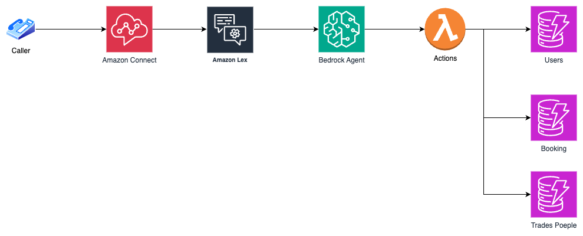

# Amazon Connect + Bedrock Agent Integration Demo

This project demonstrates how to integrate Amazon Connect with Amazon Bedrock Agent to build a generative AI-powered customer call center. The demo showcases a tradesperson booking assistant that helps callers find and book tradespeople through natural voice conversations. The solution accompanies this [blog post](https://builder.aws.com/content/2zx0dCEoXx0rB4z33jAzwSWAUOF/building-an-ai-powered-call-center-with-amazon-connect-and-bedrock-agent) on the AWS Builder Center.


## Overview

This code sample shows how to:

- Create and configure an Amazon Bedrock Agent with custom actions
- Integrate the Bedrock Agent with Amazon Connect via Amazon Lex
- Build a voice-based virtual assistant accessible through phone calls
- Implement a complete booking system with DynamoDB backend

## Features

- **Search for Tradespeople**: Find tradespeople based on trade specialty, location, and rating
- **Check Availability**: Check if a tradesperson is available on a specific date and time
- **Create Bookings**: Book a tradesperson for a specific date and time
- **View Bookings**: Retrieve booking details by booking ID or get the latest booking
- **Register Customers**: Register new customers with name and location
- **Cancel Bookings**: Cancel an existing booking
- **Update Bookings**: Change the date and time of an existing booking

## Architecture



This solution uses a serverless architecture to create an AI-powered call center:

Amazon Connect handles incoming calls and provides the telephony interface. When a customer calls, Amazon Lex processes the initial voice input and bridges to Amazon Bedrock Agent, which leverages the Nova-Micro foundation model to understand customer intent. The Bedrock Agent orchestrates the conversation flow and calls appropriate actions implemented in AWS Lambda. The Lambda function interacts with DynamoDB tables to manage customer data, tradesperson information, and booking records. This architecture enables natural, conversational booking experiences while maintaining a scalable, cost-effective backend.

## Deployment

The project is deployed using AWS CDK. To deploy:

1. Install dependencies:

   ```
   npm install
   ```

2. Build the project:

   ```
   npm run build
   ```

3. Deploy the stack:

   ```
   cdk deploy
   ```

4. After deployment, you'll receive a phone number that can be used to call the assistant.

## Usage Examples

Here are some examples of how callers can interact with the assistant:

- "I need an electrician in London"
- "Check if John Smith is available tomorrow"
- "Book a plumber for June 15th at 10 AM for a leaky faucet"
- "Show me my latest booking"
- "Cancel my booking"
- "Update my booking to next Monday at 2 PM"
- "Register me as a new customer"

## Project Structure

- `/bin`: Contains the CDK app entry point
- `/lib`: Contains the CDK stack definitions
  - `booking_assistant-stack.ts`: Main stack that orchestrates all components
  - `booking-agent-stack.ts`: Bedrock agent, DynamoDB tables, and Lambda function
  - `lex-chat-stack.ts`: Lex bot configuration for Connect integration
  - `connect-call-stack.ts`: Amazon Connect configuration for voice interface
- `/lambda/python`: Contains the Lambda function code
- `/test`: Contains unit tests

## Extending the Demo

To add new features to the call center assistant:

1. Update the Lambda function in `/lambda/python/index.py`
2. Update the API schema in `/lib/api-schema.json`
3. Update the agent instructions in `/lib/agent-instruction.txt` if needed
4. Update the CDK stack in `/lib` if infrastructure changes are required
5. Deploy the changes using `cdk deploy`

## Security

See [CONTRIBUTING](CONTRIBUTING.md#security-issue-notifications) for more information.

## License

This library is licensed under the MIT-0 License. See the LICENSE file.
